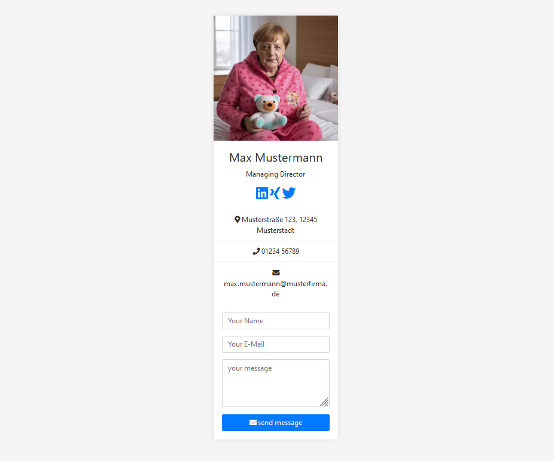

# Web Business Card

Image A.I. generated 😅

This is a simple web business card designed using HTML, with styles provided by Bootstrap and icons from Font Awesome.

## Features

- **Bootstrap:** The layout and styling of the web business card are implemented using Bootstrap, a popular CSS framework.
- **Font Awesome:** Icons for various sections such as social media links are sourced from Font Awesome, a comprehensive icon set.

## Usage

To view the web business card, simply open the `index.html` file in your web browser. You can also deploy it to a web server for online access.

## Author
[Volkan Sah](https://github.com/volkansah)

Feel free to customize this web business card to suit your needs!

